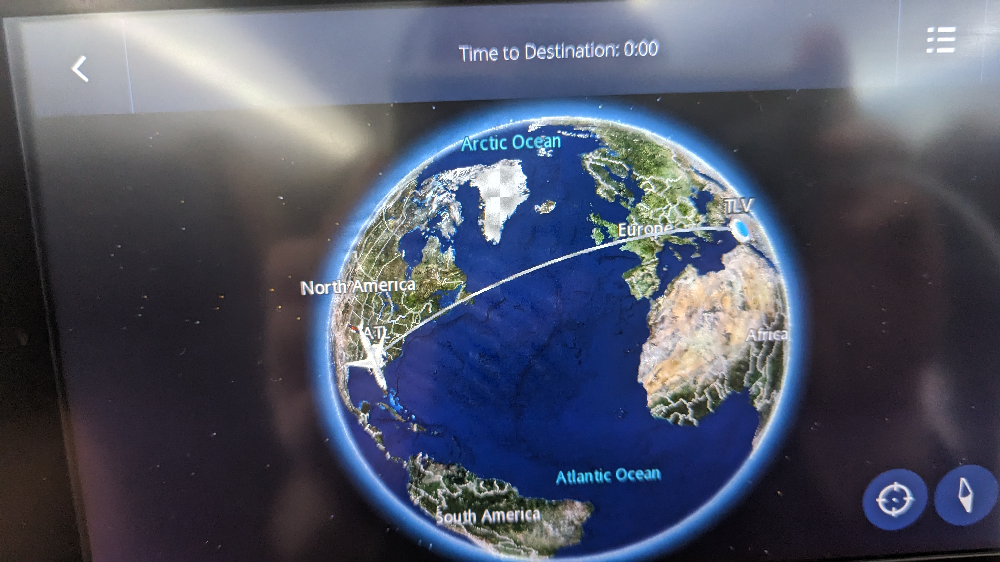
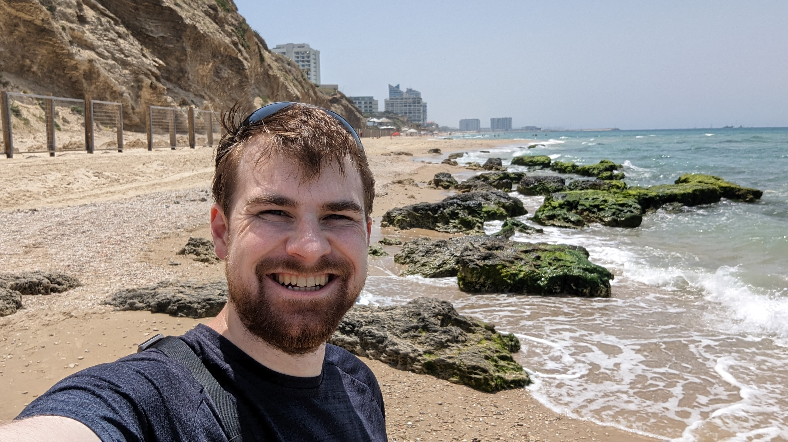
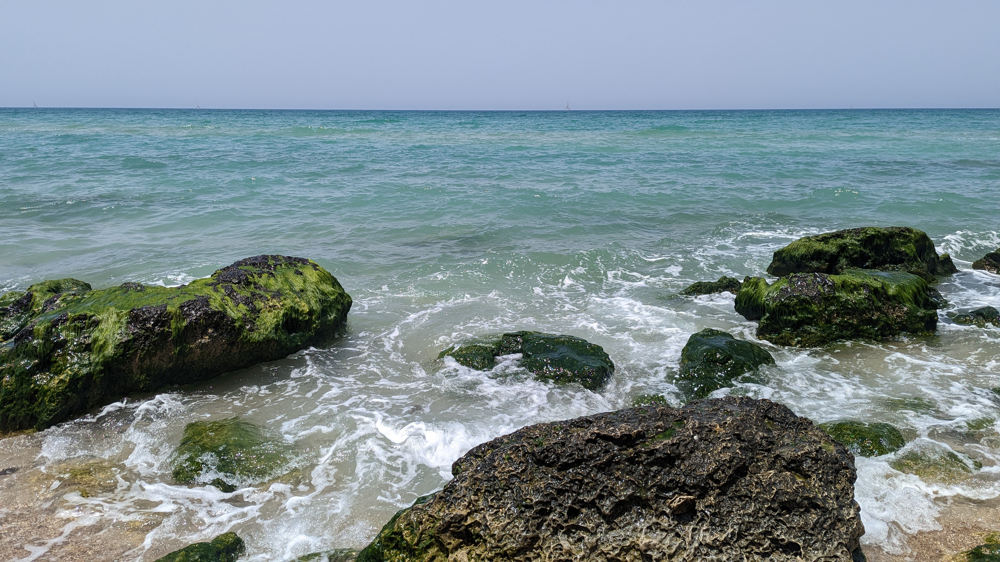
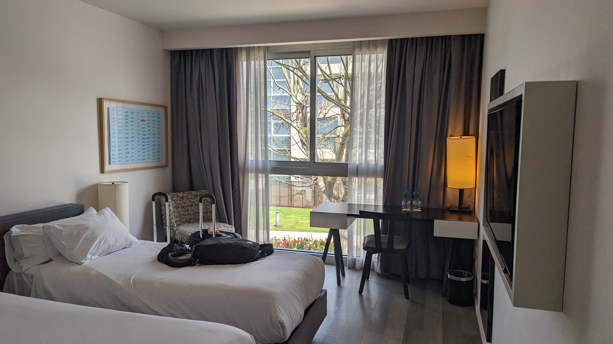
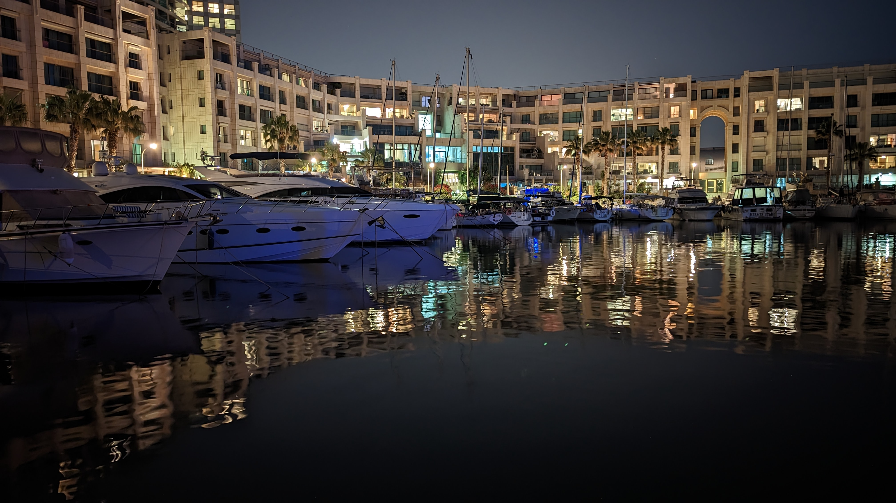

Woke up at 2:30 AM to head to the DSM airport. Travel was, as travel is, boring. Had a stop in Atlanta, Georgia airport for a few hours then a 11 hour 5 minute looooong plane ride to the Tel Aviv airport in Israel. I was kind of nervous for this LONG airplane ride for a while and planned to buy myself a Bose QuietComfort 35 headset for the journey. Figured I'd throw it on my Amazon christmas list and buy it sometime in February or March. BUT my crazy parents bought them for me!!! They didn't even know about the trip, they just knew that 2022 was kind of rough and wanted to make things special! Absolutely blew me away when I opened that present. I mean I saw they had some decent (cheap) Beats Headphones so I *assumed* incorrectly that they were getting a pair for everyone when I opened the present and saw the headset. But reading the "Bose" on the front made me go "wuuuuuuuuuuuut????!!!". Absolutely amazing!! Thanks mom and dad!!!

Anyway, those headphones are the BEST travel buddy money can buy. Oh my gosh, it drowned out the infant who was crying 2 seats back the WHOLE 11 hours. Anyway, plane rides are plane rides, nothing really eventful. When I landed, I arrived 10 hours earlier than the rest of the group so I did not plan on sticking around the airport for that time. I decided to try and get an Uber to the hotel. Jokes on me, Israel doesn't have Ubers, so I just got in a taxi at the airport. I hadn't done the currency exchange and had no frame of reference on anything and the dude was like "Oh the Herods Herzia? Fancy, it'll be 300 shekels to get there" so I was like "sure, dude". That was a 1 hour drive that cost nearly $90 USD. What I learned on that CRAZY taxi ride was that folks in Israel have a death-wish when driving and that the Hebrew language isn't really that fun to listen to. I legitimately thought the dude was having a coughing fit at one point... he was talking on the phone.

Got to the hotel and they didn't have my room ready but they let me store my luggage in a back room and I took my swimming suit and travel bag with my wallet, phone, and passport and I headed to the beach! The hotel was RIGHT on the waterfront of the Mediterranean Sea, it was beautiful! That water is so clean and blue, I've been to the ocean a few times but this was so much more vivid and clear. It was kind of unreal. I walked maybe 2-3 total miles down the beach before I met a dead end and had to turn back. Saw a LOT of interesting people, people who were drop dead gorgeous wearing basically nothing at the beach, and folks who were very much the opposite, in terms of eye candy, wearing the same lack of clothing.

I REALLY REALLY wanted to set my bag down for just a minute and go out and swim, just taking a quick dip and jumping out. But given the fact that I was alone and that bag had everything I NEEDED to get out of the country. I decided it wasn't worth the risk, so I just waded into the water - waist deep - with my bag and just enjoyed the cool water on my legs and waist.

Finally got to my room and had a lovely nap then went and met the tour folks at the welcome dinner. Met my roommate Jake Silver who had just graduated college and kind of last minute got to go on the trip. He was very bright eyed and bushy tailed the whole time. He was a delight to have as a roommate!

We all went to bed early to counter the jet-lag and get a nice head start on the INCREDIBLE, life changing adventure early in the morning the next day.

